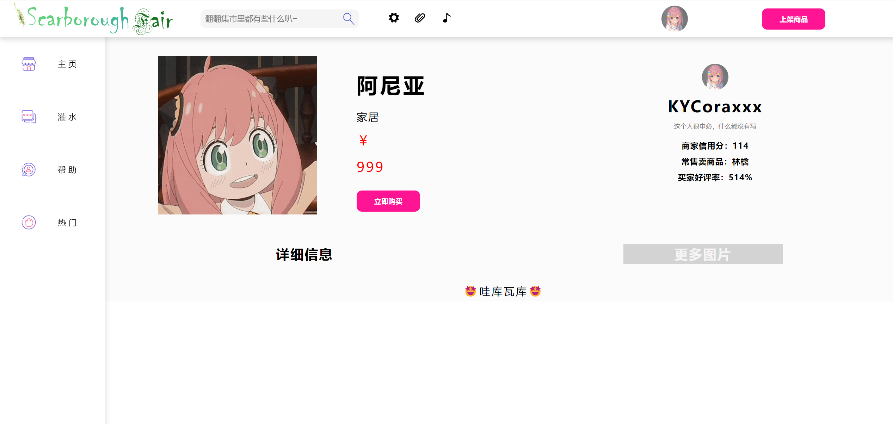

# 第六组

## NJU-SE-Internet-Computation-Project

### 项目主题

小组选题为**web应用开发**

主题是类似于跳蚤市场的模拟购物网页，取名为斯卡布罗集市（`ScarboroughFair`）

### 小组构成

此网站为南京大学软件学院2021级本科生大二上学期课程`互联网计算`大作业

小组成员情况如下: (排名不分先后)

|  姓名  |   学号    | 职责 | 分工 |
| :----: | :-------: | :--: | :--: |
| 刘汉弈 | 211250211 | 组长 | 前端 |
| 和钰超 | 211250185 | 成员 | 前端 |
| 杨海涛 | 211250195 | 成员 | 后端 |
| 张铭铭 | 211250234 | 成员 | 后端 |
| 张哲恺 | 211250245 | 成员 | 全栈 |

### 项目环境

#### 前端

- jQuery: 3.6.1

#### 后端

- java: 1.8

- mysql: 8.0.31 for Linux on x86_64

### 项目内容

本项目一共制作了6个功能页面，其功能描述如下：

#### login.html

本页面实现了用户登录、用户注册以及简单的判断用户是否存在、确认密码是否一致、密码是否正确的功能，登录、注册成功后反馈信息给用户并进行页面跳转。


#### universal组件

实现了顶部栏、侧边导航栏。其中顶部栏实现了网站首页跳转、~~只有后端的搜索功能、~~ 个人中心跳转、代码仓库跳转、背景音乐播放、显示用户头像及下拉栏（参考bilibili，含有个人中心以及退出登录的接口）、上传商品接口；侧边导航栏实现了主页、论坛和帮助~~以及没做的热门~~页的相互跳转。


#### index.html

本页面实现了活动轮播图（播放浏览量较高的商品图片）、所有商品的分类展示和商品详情页的跳转。


#### detail.html

本页面实现了展示商品的封面、名称、分类、价格和~~不能做也确实没做的~~购买的功能，并展示了商家的部分信息和商品的详细信息与更多图片。



#### usercenter.html

本页面实现了展示并更改用户的头像、用户名、签名的功能。


#### upload.html

本页面实现了上传商品的功能，其中商品信息包括商品名、分类、价格、详细信息、封面以及更多图片，当特定内容未被填写时而用户点击“上传商品”时，商品不会被上传且页面将反馈信息给用户。


#### forum.html

本页面实现了多图片帖的发布和全栈已发布帖的浏览、对帖子的点赞和评论以及对评论的点赞。


### 运行说明

本网站已部署至云服务器，可直接通过project.internet-computation.icu进行访问。

#### 前端运行说明

本项目运行Spring Boot框架后即可直接访问前端网页。

#### 后端运行说明

在运行ScarboroughFairApplication后即可启动后端框架，或者在项目根目录文件夹下用命令行输入
``` bash
./mvnw spring-boot:run
```
即可通过在浏览器中输入网址`localhost:8080`或`127.0.0.1:8080`运行。

如果要在本地运行mysql数据库而不继承云端服务器的数据，请在`detail.js`，`universal.js`和`login.js`中将前几行的`server`变量赋值为存储图片的服务器ip地址，并在`./src/main/resources/application.properties`中将file.uploadFolder的值改为存储图片的文件夹路径。

### 项目介绍

首先用户可在登录页面登录或注册信息。


用户登陆后进入主页（也可以通过点击顶部栏中ScarboroughFair的Logo或左侧导航栏中“主页”进入）。可在此页面浏览高浏览狼商品轮播图和所有已上架商品，或根据用户需求浏览特定分类的商品。点击“查看详情”即可进入商品详情页。


进入商品详情页后用户可浏览商品的详细信息和商家的部分信息，并选择购买商品 ~~（点击有彩蛋）~~。点击“详细信息”查看商家提供的商品描述，点击“更多图片”查看商家提供的更多商品图片。


用户可在顶部栏中点击齿轮按钮或光标悬浮在头像后点击“个人中心”进入个人中心页面。用户可在此页面浏览自己的头像、用户名和签名并更改之。


用户可在左侧导航栏中点击“灌水”进入灌水区页面。用户可在此发帖（最多上传9张图片）、浏览所有用户的帖子和评论点赞帖子。

用户可在顶部栏中点击“上传商品”进入商品上传页。用户可在此添加填写用户想要上传商品的信息并上传商品。

