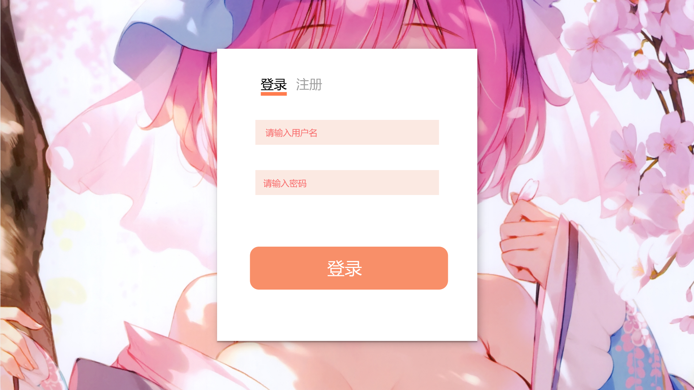
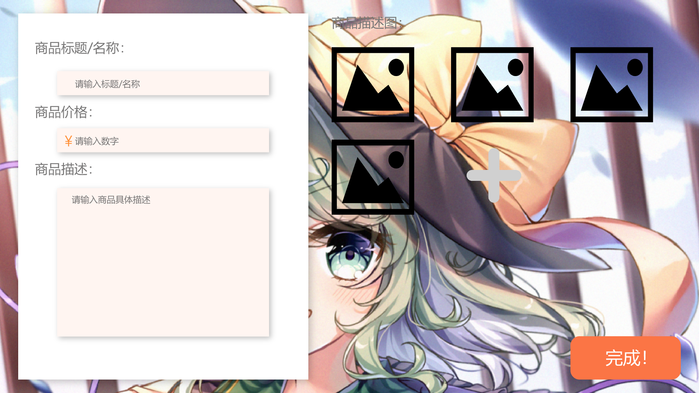

##所有页面的UI设计（草稿）

###登录界面（login）

####可能会用到的css代码（仅仅供参考，毕竟位置是absolute的qwq）：
#####整体所在的小页面
```css
/* web 1366 */
position: relative;
width: 720px;
height: 809px;

background: rgb(255, 255, 255);
box-shadow: 5px 5px 30px rgba(0, 0, 0, 0.25);;
```


#####登录/注册bar:
```css
/* 被选中的字体（登录字样） */
color: rgb(0, 0, 0);
font-family: Microsoft YaHei;
font-size: 36px;
font-weight: 400;
line-height: 48px;
letter-spacing: 0px;

/* 未被选中的字体（注册字样） */
color: rgb(159, 159, 159);
font-family: Microsoft YaHei;
font-size: 36px;
font-weight: 400;
line-height: 48px;
letter-spacing: 0px;

/* 被选中选项下方的标记矩形 */
background: rgb(255, 124, 78);

```


#####用户输入框:
```css
/* 默认提醒字体 */
color: rgb(248, 105, 105);
font-family: Microsoft YaHei;
font-size: 24px;
font-weight: 400;
line-height: 32px;
letter-spacing: 0px;

/* 用户输入字体 */
color: rgb(0, 0, 0);
font-family: Microsoft YaHei;
font-size: 24px;
font-weight: 400;
line-height: 32px;
letter-spacing: 0px;

/* 输入框 */
/* 矩形 2 */
width: 508px;
height: 69px;

background: rgba(244, 188, 168, 0.33);
```

#####确认按钮:
```css
/* 字体 */
color: rgb(255, 255, 255);
font-family: Microsoft YaHei;
font-size: 48px;
font-weight: 400;
line-height: 63px;
letter-spacing: 0px;

/* 按钮 */
width: 548px;
height: 119px;

background: rgb(248, 143, 105);
border-radius: 25px;
```

###宝贝上架页面

#####宝贝描述所在小页面（左侧小页面）：
```css
/* 页面 */
position: relative;
width: 797px;
height: 1006px;


background: rgb(255, 255, 255);
box-shadow: 5px 5px 30px rgba(0, 0, 0, 0.25);;

/* 输入框外部字体（如“商品标题/名称”） */
color: rgb(120, 119, 119);
font-family: Microsoft YaHei;
font-size: 36px;
font-weight: 400;
line-height: 48px;
letter-spacing: 0px;

/* 输入框提示字体 */
color: rgb(120, 119, 119);
font-family: Microsoft YaHei;
font-size: 24px;
font-weight: 400;
line-height: 32px;
letter-spacing: 0px;

/* 输入框输入后字体 */
color: rgb(0, 0, 0);
font-family: Microsoft YaHei;
font-size: 24px;
font-weight: 400;
line-height: 32px;
letter-spacing: 0px;

/* 小输入框 */
width: 582px;
height: 66px;

background: rgba(255, 225, 214, 0.33);

/* 大输入框 */
width: 582px;
height: 407.48px;

background: rgba(255, 225, 214, 0.33);
```
#####上传图片展示:
```css
/* 图片 */
width: 227px;
height: 254px;
```

#####完成按钮:
```css
/* 按钮 */
width: 303px;
height: 119px;

background: rgb(251, 117, 69);
border-radius: 25px;

/* 按钮内字体 */
color: rgb(255, 255, 255);
font-family: Microsoft YaHei;
font-size: 48px;
font-weight: 400;
line-height: 63px;
letter-spacing: 0px;
```