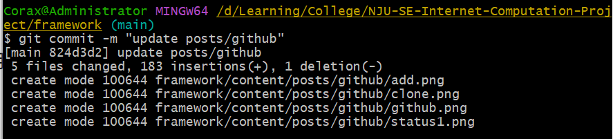

## Github简介

Github是一个面向开源及私有软件项目的代码托管平台，**仅支持Git作为唯一的版本库格式**

主要优点在于其**分布式版本控制**，克隆(clone)的库可以独立使用，任意两个库都可以进行合并(merge)

本页面主要讲解新手在使用分布式版本控制系统进行合作时需要注意的事项

## GitHub基本操作

首先介绍github的基本操作，包括clone, add, commit, push, pull, status, checkout, merge, stash

**点击[链接](https://www.bilibili.com/video/BV1VG41137RA/?spm_id_from=333.999.0.0&vd_source=20202ec91c1882d95954b8843ae70102)可以进入b站观看详细的github操作视频**

### 克隆

克隆是将自己**拥有权限**的代码仓库复制到本地的操作

主要的克隆方式有两类，一类是使用`IDE`内嵌的Git组件进行克隆，另一类则是通过命令行进行克隆

这里只讲解通过命令行进行克隆的操作，`IDE`内嵌Git组件的使用请自行STFW

~~~~bash
git clone <url>
~~~~

使用这条命令即可克隆github上的远程仓库，url链接在仓库的Code按钮中获取，如下图所示

使用HTTPS协议时可以**直接克隆public仓库**，但一般受限于网络原因容易Timeout

使用SSH协议进行克隆时需要先配置好本地的**SSH-Key**，具体方法可以参见上面的视频链接

### 状态

Git系统会实时追踪init后的仓库中的所有文件，因此可以通过命令查看当前仓库中文件的状态：

~~~~bash
git status
~~~~

接下来将在实际的例子中讲解这个命令的使用

### 添加追踪

当你在仓库中新建了一个文件/目录，它们就成为了Git系统**追踪之外的文件**；当你对仓库中已有的文件/目录进行了修改之后，Git系统就会检测到它们被你进行了修改，不再是Git**之前追踪到的文件**，可以通过查看状态的命令查询它们

这时就需要对这些文件添加追踪，使用命令

~~~~bash
git add .
~~~~

其中的`.`表示给当前目录下的所有文件添加追踪

再使用查看状态的命令进行查询，就可以发现这些文件已经进入了Git系统的追踪之中

### 提交更改

当Git系统成功追踪了新增/改动（统称`更改`）过的文件，就可以将更改提交到Github平台上，使用命令

~~~~bash
git commit -m <commit message>
~~~~

-m是可选参数，如果不写就不用在后面写commit message，Git会跳转到Vim编辑器等待你输入更改信息

**每次提交更改必须要添加commit message说明更改了什么文件，不要输入无意义内容，方便进行版本管理和团队合作**

所以在提交时输入-m会节省一些操作，作者强烈推荐这样操作

提交更改后再查询文件的状态可以发现本地更改树已经被清空了

其中的commit message在你将更改push到远程仓库之后会被显示在Git History中

### 上传更改

完成更改后需要将你的更改和附加的信息上传到Github远程仓库，使用命令

~~~~bash
git push
~~~~

即可完成向远程仓库的推送

### 签出

签出命令可以切换当前所在的分支或者创建分支，使用命令

~~~~bash
git checkout <branch-name>
~~~~

即可完成分支的切换，主要结合stash命令使用

### 拉取

拉取命令可以同步本地代码与远程代码仓库的版本，使用命令

~~~~bash
git pull
~~~~

即可完成代码版本的同步

### 合并

合并命令可以合并两个不同的分支，使用命令

~~~~bash
git merge <branch-name>
~~~~

即可完成当前分支与branch-name分支的合并，进行这个操作同样需要输入附加信息

值得说明的是，这个命令会在**团队协作没有处理好的时候自动触发**，其中一种可能的情况如下：

李四负责在星期六维护项目代码，他花了一天的时间来更改`index.php`，但是负责在星期五维护项目代码的张三在星期六中午吃饭的时候突然想起自己昨天写了一个bug，所以他立马完成了更改并push到了github仓库，结束了一天的忙碌的李四在深夜push代码，却被git提示代码版本太旧（因为张三的操作导致远程仓库先于李四本地代码一次提交），于是他拉取了远程仓库的代码，但是git又给他弹出了一个vim编辑器界面，但他实在是太累不想加班了，于是直接跳过了这个环节。第二天他发现`index.php`中有一片段已经变成了一堆乱码，因为张三和李四**都对这一段进行了不同的修改**，但是李四**跳过了merge的环节**😭……

如何避免这样的情况？作者将在下一章节进行说明

### 暂存

暂存命令是出现上面这样的情况的紧急抢救手段，在完成提交(add)之后使用下面的命令就可将你的更改暂存在本地，**你也可以在后面跟上一个分支名，将它暂存在本地另一分支，事实上这是常用的做法**，这样即使merge出现了问题，也有备份可以还原，**多备份是好习惯**，但是作者自己也记不住😄

~~~~bash
git stash
~~~~

完成暂存之后，使用命令

~~~~bash
git stash show
~~~~

可以查看暂存的内容，使用命令

~~~~bash
git stash apply
~~~~

可以还原暂存的内容

你可能已经感受到，这条命令相对而言相当复杂😔，为了规避需要使用这条命令，作者将说明我们在团队协作时需要特别注意的事项

## Github合作注意事项

### 更改附加信息

当你对仓库代码进行了一些迭代更改，**一定要认真**填写附加的更改信息，便于别人知道你做了什么更改，如果你觉得没有做什么事只是略加修改，即使填写`nothing`也不要填写与项目无关的信息

### 良好的拉取/推送习惯

在开始工作之前，请一定记得**先pull远程仓库的代码**

在结束工作之后，请一定记得要**push自己对代码的改动**

### 良好的分工声明

当你有确定的职责分工时，除非和另一职责的成员做好了沟通，否则不要改动他的代码

当你还没有职责分工时，先和项目负责人确定自己的职责范围后，再对代码进行改动

### 不要擅自合并分支

当你需要对代码进行改动的时候，优先在自己的分支上进行更改，如果没有自己的分支，请先联系项目的负责人，根据他的意见进行操作，通常这类人会非常熟悉如何进行merge操作，否则**你将会为merge后代码的丢失负责**
