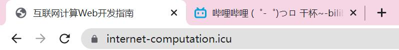

学习web开发不能纸上谈兵，请多动手尝试和阅读他人代码

## HTML简介

### Overview

HTML，英文全称为${\color{red}{H}}yper{\color{red}T}ext~{\color{red}M}arkup~{\color{red}L}anguage$，即**超文本标记语言**

需要注意的是它是一门**标记语言**，而非编程语言，你可以将它类比为更加复杂的markdown语法

事实上，markdown语法与HTML语法有许多共通之处，一些Markdown编辑器本身就有将文档转化为HTML文档的功能支持，你不妨在markdown文档中输入一个HTML标签试试

~~~~markdown
<h1>这是一个一级标题</h1>
<h2>这是一个二级标题</h2>
<strong>这是一条重要的内容</strong>
<small>这是一条很小的内容</small>
~~~~

与其说`HTML`是一门语言，不如说它是一套完备的**标签符号系统**(⊙﹏⊙)

与markdown语法类似，HTML主要的特点如下：

- 使用标记标签来**描述**网页
- 其文档包含HTML**标签和文本内容**

其中用HTML语言写出的文档也称为web页面

### HTML标签

类似于Markdown语法有`**`，`*`，`#`等标签，HTML有一套完整的，更加繁琐的，但是更加易读，更加规范，功能扩展性更强的标记标签系统，它有如下的特征：

- 所有HTML标签都是由**尖括号**包围的英文关键词，你几乎可以一眼看出它想表达什么意思
- HTML标签通常成对出现，其中第一个标签形如`<>`，称为**开放标签**；第二个标签形如`</>`称为**闭合标签**

一些功能单一、表意单一的**空标签**也会单独出现，例如*换行符*` `，*分割线*`
`

值得指出的是这样的标签其实**也具有开放标签和闭合标签**，**只是他们被合并在了一个标签之中**😮

你可能会在有的代码中看见` `的写法，但这样是不规范的，因为在`XHTML`,`XML`中，以及`HTML5`开始，**空标签必须被关闭**

为了兼容性考虑，绝对不应该写出没有被关闭的空标签，否则将无法正常解析

### HTML元素

在解释清楚HTML标签之后，HTML元素就非常容易说明了😄

HTML元素包含了**开放标签，结束标签和它们中间的文本内容**

### 开发工具

#### IDE

诸如`VSCode`,`PHPStorm`,`notepad`😊的代码编辑器，良好的个性化配置能有效地帮助你快速编辑web开发代码

#### 浏览器

浏览器是帮助你预览代码效果的强大工具，在这里作者特别推荐**谷歌浏览器**，其集成完善的**开发者工具**能有效帮助你进行debug和效果分析，通常可以使用F12快捷键进行呼出

但需要说明的是当你的项目不再是单文件代码时，仅凭借浏览器直接打开就无法预览它的效果了，相信大家在学习C/Java的过程中已经了解到，要运行多文件项目时需要依靠一些框架工具/自己进行复杂的文件链接绑定配置，但此页面只是HTML的知识笔记，有关环境搭建的问题作者将在后面提到

### HTML版本说明

语言都是在不断发展进步的，随着网络技术的不断发展，HTML也随之具有众多发行的稳定版本

| HTML版本名称 | 发布时间 |
| :----------: | :------: |
|     HTML     |   1991   |
|    HTML+     |   1993   |
|   HTML 2.0   |   1995   |
|   HTML 3.2   |   1997   |
|  HTML 4.01   |   1999   |
|  XHTML 1.0   |   2000   |
|    HTML5     |   2012   |
|    XHTML5    |   2013   |

其中XHTML是**可扩展**超文本标记语言，从HTML 4.01到HTML5，语言的表示能力，**功能的丰富程度**有了极大的飞跃，本页面将主要介绍HTML5之前的语法知识，关于HTML5的进阶语法使用在以后也许会另开一个页面记录😴

## HTML语法

### HTML网页结构

<!-- 这是一段注释 -->

正如前文所述，HTML文档具有清晰明确的框架结构，由文档类型声明开启，在html标签中包含文档的具体内容，具体内容中分为头部和主体，分别用head标签和body标签标识，在一个网页中，只有包含在body标签内的内容会被渲染展示出来

~~~~html
<!DOCTYPE html>
<!-- html中使用这样的标签标识注释 -->
<html>
    <head>
    	<!-- write your declaration and settings here -->
    </head>
    <body>
    	<!-- write your content here -->
    </body>
</html>
~~~~

#### 文档类型声明

即文档开头的`<!DOCTYPE html>`标识这个文档是HTML文档，你可能在一些文档中看不到这一句或者是其他大小写类型，但从HTML5开始，**文档类型声明不可缺失**，并且为了兼容XHTML考虑，**应该使用全大写的`!DOCTYPE`和全小写的`html`**

#### HTML注释

HTML的注释同样也使用标签进行标识，标签语法为`<!--  -->`，在使用时需要注意注释标签**不是空标签**，它由一个开放标签和一个闭合标签组成，这意味着你可以对注释进行任意分段，对注释的解析会直到读到闭合标签为止😚

需要特别注意的是，HTML的注释**不会像编程语言一样在编译的过程中被编译器直接忽略**，它会一直记录在HTML文档中，所以当你在对HTML文档的表现进行调试的时候，**不要将release时不需要的语句注释了事，而一定要将它删掉**，否则它可能会影响网页在不同情况下的表现，当然，为了增强可读性而添加的非代码注释强烈建议多写并且保留

如果你对这条规则感到疑惑，可以使用markdown编辑器打开本页面找到文件中（非代码块内）一条注释的位置，然后使用开发者工具查看它在网页中的存在形式😄

### HTML头部

即HTML文档中包含在`<head>`标签内的内容，主要用于声明字符集，网页标题，多文件、库的链接和内部样式表等

#### 字符声明

为了保证你网页中的中文内容在不同的情况下不会成为一堆乱码（例如有的用户的默认字符集可能不支持中文），你需要在HTML头部的声明此文档使用的字符集

~~~~html
<head>
	<meta charset="utf-8">
    	<!--
	utf-8是支持中文的字符集之一，
	如果你要使用别的语言，
	可能还需要声明其他字符集
	-->
</head>
~~~~

#### 网页标题

网页标题，就是你打开一个网页其标签显示的内容，例如`internet-computation.icu`的标题是`互联网计算Web开发指南`，`www.bilibili.com`的标题是`哔哩哔哩 (゜-゜)つロ 干杯~-bilibili`

自定义网页标题的语句如下：

~~~~html
<head>
    <title>互联网计算Web开发指南</title>
</head>
~~~~

#### 外部链接&内部样式表*

对应简介中链接多文件，代码库和内部样式表的功能，在理解并使用CSS和JavaScript之前不会经常用到，这里只做简单的举例说明

~~~~html
<head>
	<link rel="stylesheet" type="text/css" href="style.css"/>
    	<!--
	这是一个指向stylesheet目录中文件名为style.css的text/css类型的文件的链接
	标签后面的部分为link标签的属性，将在下面提到
	link标签同样也是空标签，用于链接多文件和代码库
	-->
    
</head>
~~~~

### HTML主体

即HTML文档中包含在`<body>`标签中的内容，决定了网页整体的表现形式和内容

#### 标签类型

即使只是HTML5之前的语法，其标签的类型也是纷繁复杂的，仅仅依靠本页面难以将众多标签全部顾及😴，所以这里只是介绍几种常用的标签，学习更多的内容请阅读[HTML标签列表手册](https://www.runoob.com/tags/html-reference.html)并尝试使用它们

值得说明的是，使用HTML标签类似于使用markdown语法和一些语言的库函数一样，想要记住每个标签的语法是怎样的，要怎样使用。并且在使用时手到擒来是**非常离谱的事情**😄，你只需要记住一些常用的标签即可，如果记不住了你可以**随时查阅手册**（不然手册是拿来干嘛的）

##### 基本标签

基本标签是在使用HTML过程中最经常使用的标签，包含标题，段落，换行，分割线和注释，后面三个在前面已经有讲到，所以这里只展开前两个标签的作用

~~~~html
<h1>这是一个一级标题</h1>
<h2>这是一个二级标题</h2>
<h3>这是一个三级标题</h3>
<h4>这是一个四级标题</h4>
<h5>这是一个五级标题</h5>
<h6>这是一个六级标题</h6>
<!--
标题的具体表现形式可以参考markdown的标题分级
虽然HTML一共提供了六级标题，但我们在使用时尽量不要使用到六级标题
因为分类太细会导致读者在阅读时难以理清你的思路
-->

这是一个段落

<!--
p标签标识其中的内容为一个段落
段落与段落之间空行的行高高于一般的换行
-->
~~~~

结合基本标签的使用，你就能以及其简洁明确的方式组织出一个网页的内容😄

##### 图像标签

顾名思义，图像标签就是用来标识一张图片的

~~~~html

~~~~

`img`标签中src的部分称为HTML标签的**属性**，如果只是为了简单地展示一张图片这样写即可，更复杂的属性我们将在后面属性的专栏讲解

另外需要注意的是`img`标签同样是**空标签**，请养成良好的编码习惯，闭合这个空标签，不过后面你可能会发现作者自己也忘了🙅‍

##### 链接标签

链接标签总共可以分为四类，`a`标签的全称为`anchor`，即锚点，它不是一个空标签，需要包含**开放标签**和**闭合标签**，下面将结合代码讲解它们的作用

~~~~html
<a href="https://internet-computation.icu">这是一个普通的链接</a>
<!--
普通的链接就是一行有蓝色下划线的文本，定向到href对应的网站
-->

<!--
这是一个图片链接，图片源文件是iclogo.jpg，链接定向到href对应的网站
-->
<a href="mailto:2631197015@qq.com">这个链接会向2631197015@qq.com发送邮件</a>
<!--
这还要注释？
-->
<a href="#标签类型">将页面下翻/上翻到标题为“标签类型”的位置</a>
<!--
这是一条书签链接，在介绍了属性之后还可以引入另外一种写法
-->
~~~~

##### 布局标签

常用的布局标签主要有两种，都不是**空标签**

~~~~html

这是一个块级元素

这是一个内联元素
~~~~

这两个标签并没有实际的意义，只是一种格式规范，在学习如何设置标签的属性之后，它们仅有的意义都可以被重载（但是没有这个必要😄），其中`div`标签仅仅标识其中的内容被放在一个块之中，一般来说即意味着它**不会和其他块级元素出现在同一行**；`span`标签仅仅标识其中的内容被视为一个内联元素，这时其中的内容会被**和块级元素放在同一行显示**

使用这两个标签可以有逻辑地组织你的页面布局，但是这个过程需要长期的练习，这也是为什么作者推荐在使用HUGO的过程中多阅读成型的框架代码

##### 列表标签

列表标签分为无序列表和有序列表，它们**都不是空标签**

其中无序列表的表现效果如下：

- 这是无序列表第一条
- 这是无序列表第二条

有序列表的表现效果如下：

1. 这是有序列表第一条
2. 这时有序列表第二条

~~~~html
<!-- unordered list -->
<ul>
    <li>这是无序列表第一条</li>
    <li>这是无序列表第二条</li>
</ul>

<!-- ordered list -->
<ol>
    <li>这是有序列表第一条</li>
    <li>这是有序列表第二条</li>
</ol>
~~~~

##### 表格标签

顾名思义，表格标签就是用来标识一个表格的，在给表格标签添加边界属性之前，表格的边框是不可见的，因此在早期常常被用于调整网页的布局，但现在由于`div`和`span`标签的出现，已经很少有网页选择使用表格作为布局的框架了

~~~~html
<table>
    <!-- table row 我猜是这个意思 -->
	<tr>
        <!-- table header 我猜是这个意思 -->
        <th>第一行第一列</th>
        <th>第一行第二列</th>
    </tr>
    <tr>
        <!-- 回复td退订:) -->
        <td>第二行第一列</td>
        <td>第二行第二列</td>
    </tr>
</table>
~~~~

##### 表单标签

这是本页面介绍的最后一个标签类型，用于收集用户的信息并进行提交，主要包含的标签有`form`标签和`input`标签

但是由于表单标签中的大部分实现都要通过设置标签的属性来完成，所以这里只做简单的举例说明

~~~~html
<form>
	<input type="text" name="firstname" placeholder="请输入你的姓"/> 
    <!-- 这条语句在网页中表现为一个等待用户输入姓的文本域，默认宽度为20个字符 -->
    
    <input type="password" name="pwd"/> 
    <!-- 这条语句在网页中表现为一个等待用户输入密码的文本域，输入的字符会被加密为*或者· -->
    
    <input type="radio" name="sex" value="male"/>男 
    <input type="radio" name="sex" value="female"/>女 
    <!-- 这两条语句表现为具有男/女两个选项的单选输入 -->
    
    <input type="checkbox" name="dinner" value="mcdonald"/>麦当劳 
    <input type="checkbox" name="dinner" value="canteen"/>食堂 
    <input type="checkbox" name="dinner" value="soil"/>土 
    <!-- 这三条语句表现为具有麦当劳/食堂/土三个选项的多选框 -->
    
    <select>
        <option>苹果</option>
        <option selected="Selected">石榴</option>
        <option>樱桃</option>
    </select>
    <!-- 这一段代码表现为一个下拉列表 -->
    
    <input type="submit" value="提交"/>
    <!-- 这条语句表现为写着提交的按钮 -->
</form>
~~~~

#### 属性

HTML属性是HTML元素提供的可供使用者自定义的附加选项，你可以将一个HTML元素视为一个对象，然后将它的属性视为它的成员变量，这个对象的特征就是由它的成员变量来描述的，而你在HTML文档中所做的事情就是调用标签内置的setter给这些对象的成员变量初始化

因此，HTML属性具有下面的两个特征：

- 对于标签属性的描述一般位于**开放标签**
- 对于属性的描述一般是以**键值对**的形式出现

其中键值对中的值请用**双引号包含值的内容，除非你的值中含有双引号才可以使用单引号**，虽然低版本的HTML对键值对的大小写并不敏感，但是为了兼容更高版本考虑，**除非在手册中它定义的就是大写字母，否则你应该统一写小写字母**

**现在，你就可以将写HTML文档视为不断地调用封装好的类的构造函数来创建对象，并调用这些对象的setter方法改变网页中这些对象的表现形式**

你应该意识到了每个标签可定义和需要定义的属性是不同的😄，所以在这里作过多的阐述并无意义，作者只挑选其中具有代表性的几个属性稍加解释，你需要学会的是**多阅读别人的代码，多了解各种属性的用处，灵活运用到自己的代码中，有需要时[查阅手册](https://www.runoob.com/tags/html-reference.html)**

##### class属性

用来定义该元素属于哪个类（从外部样式文件css中引入）

##### style属性

用来定义该元素的行内样式（css style）

##### id属性

给予元素一个**唯一确定**的标识符，可用于`<a>`标签的跳转

##### name属性

在`<form>`标签中的每一个元素都**必须要有这个属性**

可以发现，上面这些普适性的属性大多都是在CSS, JavaScript以及后端交互时才会使用，因此我们将在对应的页面中作更多阐述

#### 文本格式化

前面提到的各种标签都是围绕着网页的整体布局和内容展开，至于非空标签内的文本内容的样式，则需要使用文本格式化的标签

下面给出一些常用的文本格式化标签

~~~~html
<b>这是一句粗体文本</b>
<!-- bold -->

<code>这是一段行内代码</code>

<em>这是一段强调文本</em>
<i>这是一段斜体文本</i>
<!-- 这两个在视觉表现上似乎是一样的，反正我是没看出区别 -->

<pre>这是一段   预格式化  文   本</pre>

这不是一段   预格式化  文   本

<!-- 你试一试就知道是什么意思了:) -->

<small>这是一段很小的文本</small>

<strong>这是一段很重要的文本</strong>
<!-- 这家伙在视觉表现上似乎和b标签区别也不大 -->
~~~~

#### 字符实体

如果你认真阅读并尝试了文本格式化中的`<pre>`标签和`
`标签，你就应该发现了HTML对于非预格式化文本，会**将多个连续空格删减为1个**🙅‍，类似的，你可能会想到一个问题，既然**尖括号已经被用于标识标签，那如果要输入小于号/大于号应该怎么办呢**(・∀・(・∀・(・∀・*)

这时候就需要使用**字符实体**

常用的字符实体有：

- `&nbsp` 不间断空格(non-breaking space)
- `&lt` 小于(less than)
- `&gt` 大于(greater than)
- `&quot` 引号

需要注意的是，虽然预格式化文本看似可以减少字符实体的使用，但是不同平台的预格式化配置不同，这样会导致网站风格的不统一，所以应该尽可能避免`<pre>`标签的使用，或是在后端对文本处理之后再统一改写为`<pre>`标签

终于写完辣🌶
